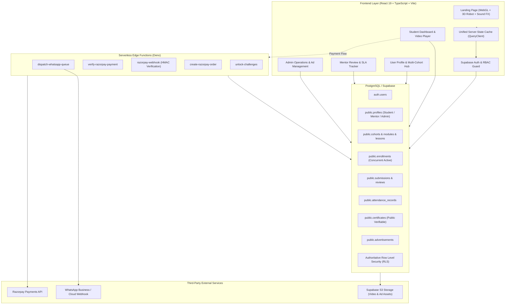
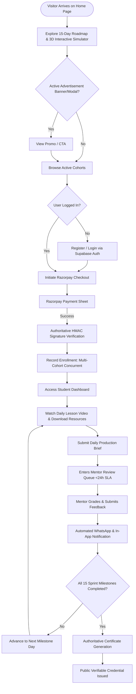
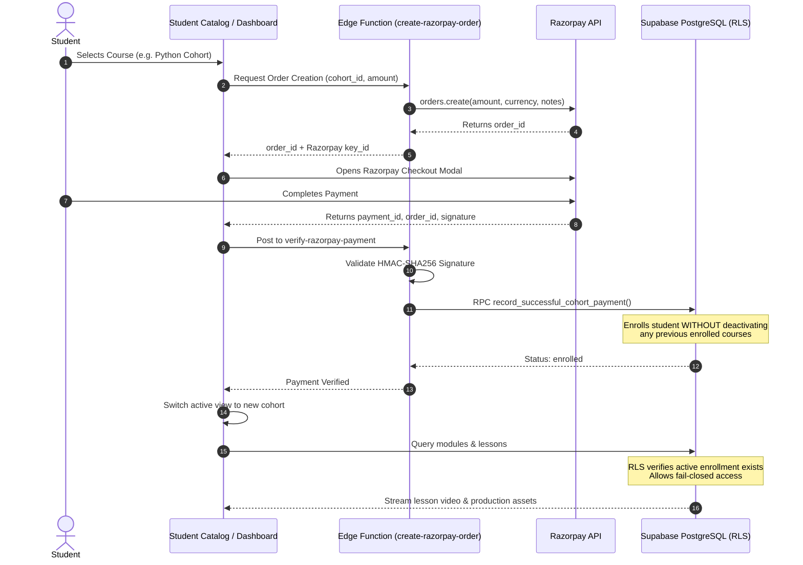
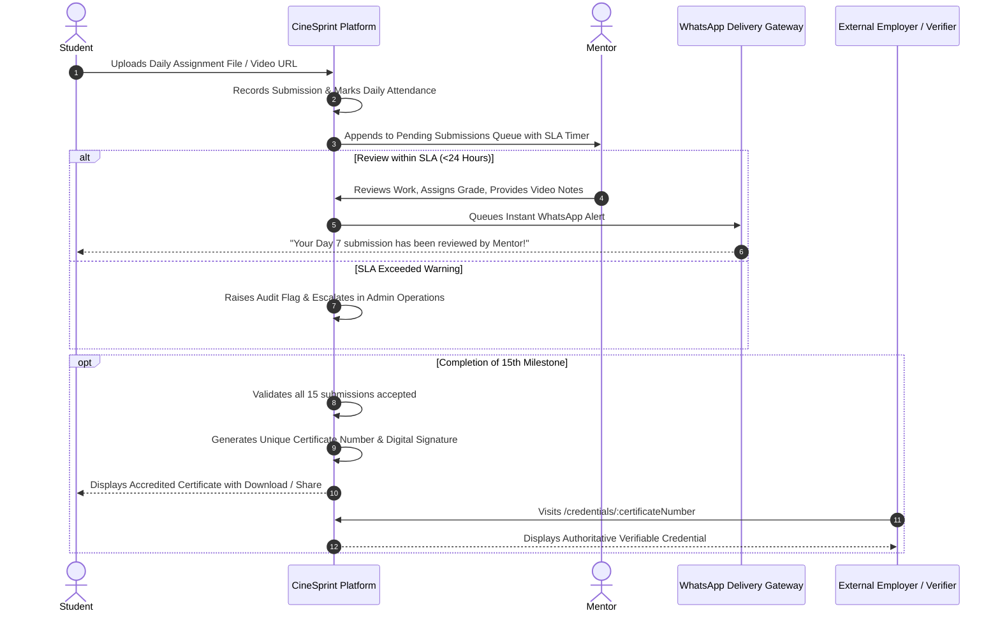

# CineSprint · Video Editing & Creative Production Cohort Platform

[](https://vitejs.dev/)
[](https://react.dev/)
[](https://www.typescriptlang.org/)
[](https://tailwindcss.com/)
[](https://threejs.org/)
[](https://supabase.com/)
[](https://razorpay.com/)
[](https://vitest.dev/)

**CineSprint** is an enterprise-grade, full-stack educational and internship platform engineered for intensive, cohort-based creative sprints. Built for aspiring creative video editors and developers, it combines hands-on production briefs, high-performance WebGL animations, authoritative course access guards, automated WhatsApp notifications, mentor evaluation SLAs, and tamper-proof public certification.

---

## Table of Contents

- [Architectural Overview](#architectural-overview)
- [System Flowcharts](#system-flowcharts)
  - [1. End-to-End User Journey](#1-end-to-end-user-journey)
  - [2. Multi-Cohort Payment & Access Enforcement](#2-multi-cohort-payment--access-enforcement)
  - [3. Daily Submission, Mentor Review & Certification](#3-daily-submission-mentor-review--certification)
- [Core Features & Modules](#core-features--modules)
  - [Landing Experience & 3D WebGL Simulator](#landing-experience--3d-webgl-simulator)
  - [Student Learning Portal & Custom Video Player](#student-learning-portal--custom-video-player)
  - [Student Profile & Multi-Course Management](#student-profile--multi-course-management)
  - [Mentor Operations & Fast SLA Review](#mentor-operations--fast-sla-review)
  - [Admin Management & Dynamic Advertisement Center](#admin-management--dynamic-advertisement-center)
  - [Community Hub & Real-Time Chat](#community-hub--real-time-chat)
  - [Public Credential Verification](#public-credential-verification)
- [Tech Stack](#tech-stack)
- [Database Schema & Security (RLS)](#database-schema--security-rls)
- [Getting Started](#getting-started)
  - [Prerequisites](#prerequisites)
  - [Environment Setup](#environment-setup)
  - [Installation & Local Run](#installation--local-run)
  - [Database Setup & Migrations](#database-setup--migrations)
- [Testing & Quality Assurance](#testing--quality-assurance)
- [Deployment](#deployment)

---

## Architectural Overview

CineSprint is designed around a zero-trust, fail-closed architecture with clear separation of concerns across presentation, server state, authoritative business logic, and database persistence.



---

## System Flowcharts

### 1. End-to-End User Journey



---

### 2. Multi-Cohort Payment & Access Enforcement

Students can hold **unlimited concurrent enrollments** (e.g., enrolled in both *Java* and *Python* cohorts simultaneously) without one course deactivating another. Access to lessons and modules is strictly guarded.



---

### 3. Daily Submission, Mentor Review & Certification



---

## Core Features & Modules

### 🎨 Landing Experience & 3D WebGL Simulator
* **Interactive 3D WebGL Simulator**: Built with HTML5 Canvas and mathematical particle kinematics. Supports three live render modes:
  * **Wave**: Undulating 3D matrix with connecting splines and dynamic mouse elevation.
  * **Nebula**: 1,400 cosmic star nodes orbiting in gravitational harmony with neural filaments.
  * **Grid**: Retro-futuristic Tron perspective wireframe mesh with real-time mouse warp.
* **Retro-Futuristic 3D Robot Terminal**: High-fidelity Three.js GLTF character with CRT visor scanlines, revving cooling fan, and audio sweep feedback.
* **Freelance Earnings Calculator**: Real-time interactive calculator showing projected ROI for students transitioning into commercial video production.
* **Audio & Motion System**: Custom procedural Web Audio API sound FX synthesizer (blips, sweeps, tones) paired with Lenis smooth scrolling and GSAP scroll triggers.

### 📚 Student Learning Portal & Custom Video Player
* **Modular Player Architecture**: Split into clean components (`VideoScreen`, `LessonSidebar`, `ResourceList`, `AssignmentSubmitCard`).
* **Milestone Gating**: Daily progression logic prevents skipping ahead until current deliverables are approved.
* **Production Resource Downloads**: Secure signed URLs for raw 4K project files, LUTs, sound effects, and project project briefs.
* **Attendance Tracking**: Automated attendance logging synced with daily video watch time and submission deadlines.

### 👤 Student Profile & Multi-Course Management
* **Comprehensive Profile Dashboard**: Shows user details, overall sprint attendance percentage, fee payment receipts, and total enrolled courses.
* **Multi-Cohort Concurrent Access**: Seamlessly switch between multiple purchased cohorts (e.g. Java, Python, Video Editing) without re-enrollment walls.
* **Self-Healing Data Layer**: Automatically detects and rectifies any legacy inactive enrollment flags in the background.

### 🧑‍🏫 Mentor Operations & Fast SLA Review
* **Submission Review Station**: Side-by-side video playback and submission review interface for mentors.
* **Turnaround SLA Telemetry**: Active countdown indicators guaranteeing <24 hour feedback turnaround.
* **Rubric Grading & Video Annotations**: Structured rubric scoring (Storytelling, Pacing, Color Grade, Sound Design).

### 📢 Admin Management & Dynamic Advertisement Center
* **Course & Curriculum Builder**: Full CRUD for creating cohorts, modules, and lessons with video storage integration.
* **Advertisement Management Center**: Dedicated upload portal for administrators to publish, edit, or remove homepage promotional banners/popups. Supports direct image uploads to Supabase Storage with public asset URLs.
* **Platform Health & Audit Logs**: Real-time revenue reporting, active student enrollment metrics, and system audit logs.

### 💬 Community Hub & Real-Time Chat
* **Community Feed**: Categorized discussion threads, media uploads, and peer feedback.
* **Real-Time Channels**: Channel-based chat backed by PostgreSQL real-time subscriptions and optimistic updates.
* **Gamification & Workshops**: Leaderboard, XP progression, level-up celebration modals, and scheduled live workshops.

### 🛡️ Public Credential Verification
* **Tamper-Proof Verification**: Anyone can verify student certificates via `/verify-certificate` or `/credentials/:certificateNumber`.
* **Zero-Trust Validation**: Directly queries the `certificates` database table to confirm student identity, course completion date, and credential status.

---

## Tech Stack

| Layer | Technologies |
|---|---|
| **Frontend Framework** | React 19, TypeScript 6, Vite 8 |
| **Styling & UI** | TailwindCSS 4, Lucide React, Glassmorphism design system |
| **3D & Animation** | Three.js (WebGL, DRACO Loader), GSAP, Lenis Smooth Scroll |
| **State & Data Fetching** | Unified Server-State Client (`useQuery`, `useMutation`, Stale-While-Revalidate) |
| **Backend & Database** | Supabase (PostgreSQL 15), Row Level Security (RLS), Realtime |
| **Serverless Functions** | Supabase Edge Functions (Deno / TypeScript) |
| **Payment Processing** | Razorpay Payment Gateway (Checkout SDK + Webhooks) |
| **Messaging & Notifications** | WhatsApp Cloud / Webhook Dispatcher, In-App Notifications |
| **Testing & Tooling** | Vitest 5, React Testing Library, JSDOM, ESLint 10 |

---

## Database Schema & Security (RLS)

All sensitive tables enforce strict **Row Level Security (RLS)** with a **fail-closed** policy:

* `profiles`: Users can read public profile details; only the profile owner or admins can modify data.
* `cohorts`: Publicly readable for active cohorts; only admins can create or edit cohorts.
* `enrollments`: Students can only view their own enrollments. Enrolling multiple active courses is supported.
* `modules` & `lessons`: Strictly readable **only** by students who have an active or completed enrollment in that specific cohort (or mentors/admins). Prevents unpaid content leaks.
* `submissions` & `assignment_reviews`: Students can only read/write their own submissions; assigned mentors and admins can grade and review.
* `advertisements`: Read access is public for active ads; insert, update, and delete restricted exclusively to admins.
* `certificates`: Public read access allowed for valid verification checks; creation restricted to system triggers and admins.

---

## Getting Started

### Prerequisites

* **Node.js**: `v20.x` or higher (LTS recommended)
* **npm**: `v10.x` or higher
* **Supabase Project**: Active Supabase project with database initialized
* **Razorpay Account**: (Optional for test mode) Razorpay Key ID & Secret

### Environment Setup

Create a `.env` file in the project root:

```bash
cp .env.example .env
```

Fill in your configuration values:

```ini
# Supabase Configuration (Required)
VITE_SUPABASE_URL=https://your-project.supabase.co
VITE_SUPABASE_ANON_KEY=your-supabase-public-anon-key

# Razorpay Client Configuration
# Use rzp_test_... for local testing or rzp_live_... for production
VITE_RAZORPAY_KEY_ID=rzp_test_your_key_id

# Optional: Remote Error Tracking
VITE_SENTRY_DSN=

# Optional: WhatsApp Webhook Proxy
VITE_WHATSAPP_PROVIDER=mock
```

### Installation & Local Run

```bash
# Install dependencies
npm install

# Start local development server
npm run dev
```

Visit `http://localhost:5173` in your browser.

### Database Setup & Migrations

The repository contains 52 sequential migrations consolidated into a master bootstrap schema:

```bash
# Verify integrity of all migrations and regenerate manifest
npm run migrations:verify

# Bundle all migrations into single schema script
npm run migrations:bundle

# Execute bootstrap script against Supabase (requires SUPABASE_DB_URL or direct connection)
npm run db:bootstrap
```

Alternatively, you can copy the contents of [`supabase/bootstrap_complete_schema.sql`](./supabase/bootstrap_complete_schema.sql) directly into your **Supabase Dashboard > SQL Editor** and execute it.

---

## Testing & Quality Assurance

The codebase includes an exhaustive test suite covering RLS policies, journey flows, payment webhooks, component rendering, and custom state managers:

```bash
# Run complete test suite (57 test files, 519+ tests)
npm test

# Run tests in interactive watch mode
npm run test:watch

# Run ESLint validation (enforces 0 warnings policy)
npm run lint

# Run TypeScript compilation and production bundle build
npm run build

# Run the complete production verification gate
npm run verify
```

---

## Deployment

### Frontend (Vercel / Netlify)

1. Connect your GitHub repository to Vercel or Netlify.
2. Set Build Command: `npm run build`
3. Set Output Directory: `dist`
4. Add all environment variables from `.env` (`VITE_SUPABASE_URL`, `VITE_SUPABASE_ANON_KEY`, `VITE_RAZORPAY_KEY_ID`).

### Supabase Edge Functions

Deploy serverless edge functions to handle Razorpay order creation and webhooks:

```bash
# Deploy all Edge Functions
supabase functions deploy create-razorpay-order
supabase functions deploy verify-razorpay-payment
supabase functions deploy razorpay-webhook
supabase functions deploy dispatch-whatsapp-queue
supabase functions deploy unlock-challenges

# Set Edge Function server secrets
supabase secrets set RAZORPAY_KEY_ID=rzp_live_...
supabase secrets set RAZORPAY_KEY_SECRET=...
supabase secrets set RAZORPAY_WEBHOOK_SECRET=...
```

---

## License

This project is proprietary software developed for the CineSprint Video Editing Cohort Platform. All rights reserved.
